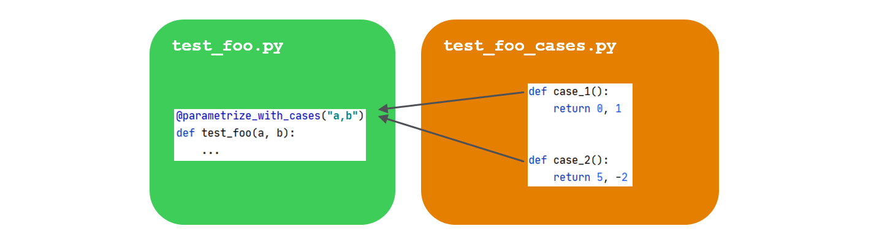
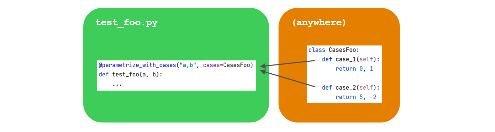

# pytest-cases

*Separate test code from test cases in `pytest`.*

[](https://pypi.python.org/pypi/pytest-cases/)  [](https://travis-ci.com/smarie/python-pytest-cases) [](https://smarie.github.io/python-pytest-cases/junit/report.html) [](https://codecov.io/gh/smarie/python-pytest-cases)

[](https://smarie.github.io/python-pytest-cases/) [](https://pypi.python.org/pypi/pytest-cases/) [](https://pepy.tech/project/pytest-cases) [](https://pepy.tech/project/pytest-cases) [](https://github.com/smarie/python-pytest-cases/stargazers)
[](https://doi.org/10.5281/zenodo.3937830)

!!! success "Major refactoring of test ids in v3.0.0 ! See [below](#c-test-ids) for details."

!!! warning "Installing pytest-cases has effects on the order of `pytest` tests execution. Details [here](#installing)"

Did you ever think that most of your test functions were actually *the same test code*, but with *different data inputs* and expected results/exceptions ?

 - `pytest-cases` leverages `pytest` and its great `@pytest.mark.parametrize` decorator, so that you can **separate your test cases from your test functions**.

 - In addition, `pytest-cases` provides [several useful goodies](./pytest_goodies.md) to empower `pytest`. In particular it improves the fixture mechanism to support "fixture unions". This is a **major change** in the internal `pytest` engine, unlocking many possibilities such as using fixture references as parameter values in a test function. See [here](./pytest_goodies.md).

`pytest-cases` is fully compliant with [pytest-harvest](https://smarie.github.io/python-pytest-harvest/) so you can easily monitor the execution times and created artifacts. With it, it becomes very easy to create a complete data science benchmark, for example comparing various models on various datasets as illustrated below (from the [example](examples.md) section):


## Installing

```bash
> pip install pytest_cases
```

Note: Installing pytest-cases has effects on the order of `pytest` tests execution, even if you do not use its features. One positive side effect is that it fixed [pytest#5054](https://github.com/pytest-dev/pytest/issues/5054). But if you see less desirable ordering please [report it](https://github.com/smarie/python-pytest-cases/issues).

## Why `pytest-cases` ?

**`pytest` philosophy**

Let's consider the following `foo` function under test, located in `example.py`:

```python
def foo(a, b):
    return a + 1, b + 1
```

If we were using plain `pytest` to test it with various inputs, we would create a `test_foo.py` file and use `@pytest.mark.parametrize`:

```python
import pytest
from example import foo

@pytest.mark.parametrize("a,b", [(1, 2), (-1, -2)])
def test_foo(a, b):
    # check that foo runs correctly and that the result is a tuple. 
    assert isinstance(foo(a, b), tuple)
```

This is the fastest and most compact thing to do when you have a few number of test cases, that do not require code to generate each test case. 

**`pytest` current limitations**

Now imagine that instead of `(1, 2)` and `(-1, -2)` **each** of our test cases 

 - requires **a few lines of code** to be generated. For example artificial data creation using `numpy` and/or `pandas`:

```python
import numpy as np
import pandas as pd

# case 1: non-sorted uniformly sampled timeseries with 2 holes
case1 = pd.DataFrame({"datetime": pd.date_range(start='20/1/1', periods=20, 
                                                freq='-1d', tz='UTC'),
                      "data1": np.arange(0, 20),
                      "data2": np.arange(1, 21),
                      "data3": np.arange(1, 21)})
case1.drop([3, 12], inplace=True)
```

 - requires **documentation** to explain the other developers the intent of that precise test case

 - requires **external resources** (data files on the filesystem, databases...), with a variable number of cases depending on what is available on the resource - but of course not all the cases would come from the same resource, that would be too easy :).

 - requires **a readable `id`**, such as `'uniformly_sampled_nonsorted_with_holes'` for the above example. Of course we *could* use [`pytest.param`](https://docs.pytest.org/en/stable/example/parametrize.html#set-marks-or-test-id-for-individual-parametrized-test) or [`ids=<list>`](https://docs.pytest.org/en/stable/example/parametrize.html#different-options-for-test-ids) but that is "a pain to maintain" according to `pytest` doc (I agree!). Such a design does not feel right as the id is detached from the case.

With standard `pytest` there is no particular pattern to simplify your life here. Investigating a little bit, people usually end up trying to mix parameters and fixtures and asking this kind of question: [so1](https://stackoverflow.com/questions/50231627/python-pytest-unpack-fixture), [so2](https://stackoverflow.com/questions/50482416/use-pytest-lazy-fixture-list-values-as-parameters-in-another-fixture). But by design it is not possible to solve this problem using fixtures, because `pytest` [does not handle "unions" of fixtures](pytest_goodies.md#fixture_union).

So all in all, the final answer is "you have to do this yourself", and have `pytest` use your handcrafted list of parameters as the list of argvalues in `@pytest.mark.parametrize`. Typically we would end up creating a `get_all_foo_test_cases` function, independently from `pytest`:
 
```python
@pytest.mark.parametrize("a,b", get_all_foo_test_cases())
def test_foo(a, b):
    ...
```

There is also an example in `pytest` doc [with a `metafunc` hook](https://docs.pytest.org/en/stable/example/parametrize.html#a-quick-port-of-testscenarios). 

The issue with such workarounds is that you can do *anything*. And *anything* is a bit too much: this does not provide any convention / "good practice" on how to organize test cases, which is an open door to developing ad-hoc unreadable or unmaintainable solutions.

`pytest_cases` was created to provide an answer to this precise situation. It proposes a simple framework to separate test cases from test functions. The test cases are typically located in a separate "companion" file:

 - `test_foo.py` is your usual test file containing the test **functions** (named `test_<id>`),
 - `test_foo_cases.py` contains the test **cases**, that are also functions (named `case_<id>` or even `<prefix>_<id>` if you prefer). Note: an alternate file naming style `cases_foo.py` is also available if you prefer it.



Test cases can also be provided explicitly, for example in a class container:



And many more as we'll see [below](#a-cases-collection).

## Basic usage

### a- Case functions

Let's create a `test_foo_cases.py` file. This file will contain *test cases generator functions*, that we will call **case functions** for brevity. In these functions, you will typically either parse some test data files, generate some simulated test data, expected results, etc.

```python
def case_two_positive_ints():
    """ Inputs are two positive integers """
    return 1, 2

def case_two_negative_ints():
    """ Inputs are two negative integers """
    return -1, -2
```

Case functions **do not have any particular requirement**, apart from the default name convention `case_<id>` - but even that can be customized: **you can use distinct prefixes** to denote distinct kind of parameters, such as `data_<id>`, `user_<id>`, `model_<id>`... 

Case functions can return anything that is considered useful to run the associated test. We will see [below](#b-case-functions) that you can use all classic pytest mechanism on case functions (id customization, skip/fail marks, parametrization, fixtures injection).

### b- Test functions

As usual we write our `pytest` test functions starting with `test_`, in a `test_foo.py` file. The only difference is that we now decorate it with `@parametrize_with_cases` instead of `@pytest.mark.parametrize` as we were doing [previously](#why-pytest-cases):

```python
from example import foo
from pytest_cases import parametrize_with_cases

@parametrize_with_cases("a,b")
def test_foo(a, b):
    # check that foo runs correctly and that the result is a tuple. 
    assert isinstance(foo(a, b), tuple)
```

As simple as that ! The syntax is basically the same than in [`pytest.mark.parametrize`](https://docs.pytest.org/en/stable/example/parametrize.html).

Executing `pytest` will now run our test function **once for every case function**:

```bash
>>> pytest -s -v
============================= test session starts =============================
(...)
<your_project>/tests/test_foo.py::test_foo[two_positive_ints] PASSED [ 50%]
<your_project>/tests/test_foo.py::test_foo[two_negative_ints] PASSED [ 100%]

========================== 2 passed in 0.24 seconds ==========================
```

## Tools for daily use

### a- Cases collection

#### Alternate source(s)

It is not mandatory that case functions should be in a different file than the test functions: both can be in the same file. For this you can use `cases='.'` or `cases=THIS_MODULE` to refer to the module in which the test function is located:

```python
from pytest_cases import parametrize_with_cases

def case_one_positive_int():
    return 1

def case_one_negative_int():
    return -1

@parametrize_with_cases("i", cases='.')
def test_with_this_module(i):
    assert i == int(i)
```

However **WARNING**: only the case functions defined BEFORE the test function in the module file will be taken into account!

`@parametrize_with_cases(cases=...)` also accepts explicit list of case functions, classes containing case functions, and modules. See [API Reference](./api_reference.md#parametrize_with_cases) for details. A typical way to organize cases is to use classes for example:

```python
from pytest_cases import parametrize_with_cases

class Foo:
    def case_a_positive_int(self):
        return 1

    def case_another_positive_int(self):
        return 2

@parametrize_with_cases("a", cases=Foo)
def test_foo(a):
    assert a > 0
```

Note that as for `pytest`, `self` is recreated for every test and therefore should not be used to store any useful information. 

#### Alternate prefix

`case_` might not be your preferred prefix, especially if you wish to store in the same module or class various **kind** of case data. `@parametrize_with_cases` offers a `prefix=...` argument to select an alternate prefix for your case functions. That way, you can store **in the same module or class** case functions as diverse as datasets (e.g. `data_`), user descriptions (e.g. `user_`), algorithms or machine learning models (e.g. `model_` or `algo_`), etc.

```python
from pytest_cases import parametrize_with_cases, parametrize

def data_a():
    return 'a'

@parametrize("hello", [True, False])
def data_b(hello):
    return "hello" if hello else "world"

def case_c():
    return dict(name="hi i'm not used")

def user_bob():
    return "bob"

@parametrize_with_cases("data", cases='.', prefix="data_")
@parametrize_with_cases("user", cases='.', prefix="user_")
def test_with_data(data, user):
    assert data in ('a', "hello", "world")
    assert user == 'bob'
```

yields

```
test_doc_filters_n_tags.py::test_with_data[bob-a]       PASSED [ 33%]
test_doc_filters_n_tags.py::test_with_data[bob-b-True]   PASSED [ 66%]
test_doc_filters_n_tags.py::test_with_data[bob-b-False]   PASSED [ 100%]
```

#### Filters and tags

The easiest way to select only a subset of case functions in a module or a class, is to specify a custom `prefix` instead of the default one (`'case_'`), as shown [above](#alternate-prefix).

However sometimes more advanced filtering is required. In that case, you can also rely on three additional mechanisms provided in `@parametrize_with_cases`:

 - the `glob` argument can contain a glob-like pattern for case ids. This can become handy to separate for example good or bad cases, the latter returning an expected error type and/or message for use with `pytest.raises` or with our alternative [`assert_exception`](pytest_goodies.md#assert_exception).
 
```python
from math import sqrt
import pytest
from pytest_cases import parametrize_with_cases


def case_int_success():
    return 1

def case_negative_int_failure():
    # note that we decide to return the expected type of failure to check it
    return -1, ValueError, "math domain error"


@parametrize_with_cases("data", cases='.', glob="*success")
def test_good_datasets(data):
    assert sqrt(data) > 0

@parametrize_with_cases("data, err_type, err_msg", cases='.', glob="*failure")
def test_bad_datasets(data, err_type, err_msg):
    with pytest.raises(err_type, match=err_msg):
        sqrt(data)
``` 


 - the `has_tag` argument allows you to filter cases based on tags set on case functions using the `@case` decorator. See API reference of [`@case`](./api_reference.md#case) and [`@parametrize_with_cases`](./api_reference.md#parametrize_with_cases).


```python
from pytest_cases import parametrize_with_cases, case

class FooCases:
    def case_two_positive_ints(self):
        return 1, 2
    
    @case(tags='foo')
    def case_one_positive_int(self):
        return 1

@parametrize_with_cases("a", cases=FooCases, has_tag='foo')
def test_foo(a):
    assert a > 0
```

 - Finally if none of the above matches your expectations, you can provide a callable to `filter`. This callable will receive each collected case function and should return `True` (or a truth-value convertible object) in case of success. Note that your function can leverage the `_pytestcase` attribute available on the case function to read the tags, marks and id found on it.

```python
@parametrize_with_cases("data", cases='.', 
                        filter=lambda cf: "success" in cf._pytestcase.id)
def test_good_datasets2(data):
    assert sqrt(data) > 0
```


### b- Case functions

#### Custom case name

The id used by `pytest` for a given case is automatically taken from the case function name by removing the `case_` (or other custom) prefix. It can instead be customized explicitly by decorating your case function with the `@case(id=<id>)` decorator. See [API reference](./api_reference.md#case).

```python
from pytest_cases import case

@case(id="2 positive integers")
def case_two_positive_ints():
    return 1, 2
```

#### Pytest marks (`skip`, `xfail`...)

pytest marks such as `@pytest.mark.skipif` can be applied on case functions the same way [as with test functions](https://docs.pytest.org/en/stable/skipping.html).

```python
import sys
import pytest

@pytest.mark.skipif(sys.version_info < (3, 0), reason="Not useful on python 2")
def case_two_positive_ints():
    return 1, 2
```

#### Case generators

In many real-world usage we want to generate one test case *per* `<something>`. The most intuitive way would be to use a `for` loop to create the case functions, and to use the `@case` decorator to set their names ; however this would not be very readable.

Instead, case functions can be parametrized the same way [as with test functions](https://docs.pytest.org/en/stable/parametrize.html): simply add the parameter names as arguments in their signature and decorate with `@pytest.mark.parametrize`. Even better, you can use the enhanced [`@parametrize`](./api_reference.md#parametrize) from `pytest-cases` so as to benefit from its additional usability features (see [API reference](./api_reference.md#parametrize)):

```python
from pytest_cases import parametrize, parametrize_with_cases

class CasesFoo:
    def case_hello(self):
        return "hello world"

    @parametrize(who=('you', 'there'))
    def case_simple_generator(self, who):
        return "hello %s" % who


@parametrize_with_cases("msg", cases=CasesFoo)
def test_foo(msg):
    assert isinstance(msg, str) and msg.startswith("hello")
```

Yields

```
test_generators.py::test_foo[hello] PASSED               [ 33%]
test_generators.py::test_foo[simple_generator-who=you] PASSED [ 66%]
test_generators.py::test_foo[simple_generator-who=there] PASSED [100%]
```

#### Cases requiring fixtures

Cases can use fixtures the same way as [test functions do](https://docs.pytest.org/en/stable/fixture.html#fixtures-as-function-arguments): simply add the fixture names as arguments in their signature and make sure the fixture exists either in the same module, or in a [`conftest.py`](https://docs.pytest.org/en/stable/fixture.html?highlight=conftest.py#conftest-py-sharing-fixture-functions) file in one of the parent packages. See [`pytest` documentation on sharing fixtures](https://docs.pytest.org/en/stable/fixture.html?highlight=conftest.py#conftest-py-sharing-fixture-functions).

!!! warning "Use `@fixture` instead of `@pytest.fixture`"
    If a fixture is used by *some* of your cases only, then you *should* use the `@fixture` decorator from pytest-cases instead of the standard `@pytest.fixture`. Otherwise you fixture will be setup/teardown for all cases even those not requiring it. See [`@fixture` doc](./api_reference.md#fixture).

```python
from pytest_cases import parametrize_with_cases, fixture, parametrize

@fixture(scope='session')
def db():
    return {0: 'louise', 1: 'bob'}

def user_bob(db):
    return db[1]

@parametrize(id=range(2))
def user_from_db(db, id):
    return db[id]

@parametrize_with_cases("a", cases='.', prefix='user_')
def test_users(a, db, request):
    print("this is test %r" % request.node.nodeid)
    assert a in db.values()
```

yields

```
test_fixtures.py::test_users[a_is_bob] 
test_fixtures.py::test_users[a_is_from_db-id=0] 
test_fixtures.py::test_users[a_is_from_db-id=1] 
```

## Advanced topics

### a- Parametrizing fixtures

In some scenarii you might wish to parametrize a fixture with the cases, rather than the test function. For example 

 - to inject the same test cases in several test functions **without duplicating** the `@parametrize_with_cases` decorator on each of them,
 
 - to generate the test cases **once** for the whole session, using a `scope='session'` fixture or [another scope](https://docs.pytest.org/en/stable/fixture.html#scope-sharing-a-fixture-instance-across-tests-in-a-class-module-or-session),
 
 - to modify the test cases, log some message, or perform some other action **before injecting them** into the test functions, and/or **after executing** the test function (thanks to [yield fixtures](https://docs.pytest.org/en/stable/fixture.html#fixture-finalization-executing-teardown-code))
 
 - ...

For this, simply use `@fixture` from `pytest_cases` instead of `@pytest.fixture` to define your fixture. That allows your fixtures to be easily parametrized with `@parametrize_with_cases`, `@parametrize`, and even `@pytest.mark.parametrize`.


```python
from pytest_cases import fixture, parametrize_with_cases

@fixture
@parametrize_with_cases("a,b")
def c(a, b):
    return a + b

def test_foo(c):
    assert isinstance(c, int)
```

### b- Caching cases

After starting to reuse cases in several test functions, you might end-up thinking *"why do I have to spend the data parsing/generation time several times ? It is the same case."*. 

`pytest-cases` follows the same philosophy than `pytest`: each test node should be independent. Therefore case functions are called for each test case. This ensures that mutable objects can not leak across tests, for example.

That being said, **if you are certain that your tests do not modify your cases data**, there are several ways to solve this issue:

 - the easiest way is to **use fixtures with a broad scope**, as explained [above](#a-parametrizing-fixtures). However in some parametrization scenarii, `pytest` does not guarantee that the fixture will be setup only once for the whole session, even if it is a session-scoped fixture. Also the cases will be parsed everytime you run pytest, which might be cumbersome
 
```python
from pytest_cases import parametrize, parametrize_with_cases, fixture


@parametrize(a=range(2))
def case_dummy(a):
    # this is read only once per a, while there are 4 test runs 
    return a

@fixture(scope='session')
@parametrize_with_cases("a", cases='.')
def cached_a(a):
    return a


@parametrize(d=range(2))
def test_caching(cached_a, d):
    assert d < 2
    assert 0 <= cached_a <= 1
```

 - an alternative is to use `functools.lru_cache` to explicitly set a memory cache on a case function. For simple cases you could simply decorate your case function with `@lru_cache(maxsize=1)` since simple case functions do not have arguments. However for case generators this is a bit more tricky to size the cache - the easiest thing is probably to let it to its default size of 128 with the no-argument version `@lru_cache`, or to remove the max limit and let it auto-grow, with `@lru_cache(max_size=None)`. See [`lru_cache` documentation for details](https://docs.python.org/3/library/functools.html#functools.lru_cache). Note that an older version of `pytest-cases` was offering some facilities to set the cache size, this has been removed from the library in version `2.0.0` as it seemed to provide little added value.
 
 - finally, you might wish to persist some cases on disk in order for example to avoid downloading them again from their original source, and/or to avoid costly processing on every pytest session. For this, the perfect match for you is to use [`joblib`'s excellent `Memory` cache](https://joblib.readthedocs.io/en/latest/memory.html). 

!!! warning "If you add a cache mechanism, make sure that your test functions do not modify the returned objects !"

### c- Test ids

Starting from version 3.0.0, test ids induced by `@parametrize_with_cases` are similar to the ids induced by `@pytest.mark.parametrize`, even if a case function is itself parametrized or requires a fixture. In some situations you may wish to get a better control on the test ids.

For this you can pass a callable to `@parametrize_with_cases(ids=<callable>)`. In this callable, you may wish to use `get_case_id`, `get_case_marks`, `get_case_tags`, or `matches_tag_query` to return a custom id.

```python
from pytest_cases import parametrize, parametrize_with_cases, case, get_case_id

def case_hello():
    return "hello !"

@case(id="hello_world")
def case_basic2():
    return "hello, world !"

@case(id="hello_name")
@parametrize("name", ["you", "earthling"])
def case_basic3(name):
    return "hello, %s !" % name

def myidgen(case_fun):
    """Custom test case id"""
    return "#%s#" % get_case_id(case_fun)

@parametrize_with_cases("msg", cases=".", ids=myidgen)
def test_foo(msg):
    print(msg)
```

`pytest -s -v` yields:

```
============================= test session starts =============================
platform win32 -- Python 3.7.3, pytest-5.3.5, py-1.9.0, pluggy-0.13.1
cachedir: .pytest_cache
(...)

test_doc_ids_debug.py::test_foo[#hello#] 
test_doc_ids_debug.py::test_foo[#hello_world#] 
test_doc_ids_debug.py::test_foo[#hello_name#-you] 
test_doc_ids_debug.py::test_foo[#hello_name#-earthling] 

============================== 4 passed in 0.07s ==============================
```

### d- Debugging

When all of your case functions are simple, `@parametrize_with_cases` generates a `@parametrize` decorator with argvalues being a list of `lazy_value(<case_func>)` for all of them. This in turn falls back to a good old `@pytest.mark.parametrize`, so the behaviour is close to what you are used to see when using `pytest`.

However when at least one case function is complex, typically when it requires a fixture, then `@parametrize_with_cases` wraps it into a fixture and passes a `fixture_ref(<fixture_wrapping_case>)` to `@parametrize`. This creates a so-called "fixture union": tests are not any more a cross-product of parameters, but a tree. This new feature brought by pytest-cases is not present in `pytest` by default, and adds a layer of complexity. But good news: starting in pytest-cases 3.0.0, this complexity is entirely hidden. In other words, generated test ids do not differ between this mode, and the simple mode. For debugging purposes however, you might wish to make this visible by setting `idstyle`:

```python
from pytest_cases import parametrize, parametrize_with_cases, case, fixture

def case_hello():
    return "hello !"

@fixture
@parametrize("_name", ["you", "earthling"])
def name(_name):
    return _name

@case(id="hello_fixture")
def case_basic3(name):
    return "hello, %s !" % name

@parametrize_with_cases("msg", cases=".", idstyle="nostyle")
def test_default_idstyle(msg):
    print(msg)

@parametrize_with_cases("msg", cases=".", idstyle="compact")
def test_compact_idstyle(msg):
    print(msg)

@parametrize_with_cases("msg", cases=".", idstyle="explicit")
def test_explicit_idstyle(msg):
    print(msg)
```

`pytest -s -v` yields

```
test_doc_debug.py::test_default_idstyle[hello] 
test_doc_debug.py::test_default_idstyle[hello_fixture-you] 
test_doc_debug.py::test_default_idstyle[hello_fixture-earthling] 
test_doc_debug.py::test_compact_idstyle[\hello] 
test_doc_debug.py::test_compact_idstyle[\hello_fixture-you] 
test_doc_debug.py::test_compact_idstyle[\hello_fixture-earthling] 
test_doc_debug.py::test_explicit_idstyle[msg\hello] 
test_doc_debug.py::test_explicit_idstyle[msg\hello_fixture-you] 
test_doc_debug.py::test_explicit_idstyle[msg\hello_fixture-earthling] 
```

See also [`@parametrize` documentation](./pytest_goodies.md#parametrize) for details.


## Main features / benefits

 * **Separation of concerns**: test code on one hand, test cases data on the other hand. This is particularly relevant for data science projects where a lot of test datasets are used on the same block of test code.
 
 * **Everything in the test case or in the fixture**, not outside. A side-effect of `@pytest.mark.parametrize` is that users tend to create or parse their datasets outside of the test function. `pytest_cases` suggests a model where the potentially time and memory consuming step of case data generation/retrieval is performed *inside* the test node or the required fixture, thus keeping every test case run more independent. It is also easy to put debug breakpoints on specific test cases.

 * **User experience fully aligned with pytest**. Cases collection and filtering, cases parametrization, cases output unpacking as test arguments, cases using fixtures... all of this will look very familiar to `pytest` users.


## See Also

 - [pytest documentation on parametrize](https://docs.pytest.org/en/latest/parametrize.html)
 - [pytest documentation on fixtures](https://docs.pytest.org/en/latest/fixture.html#fixture-parametrize)
 - [pytest-steps](https://smarie.github.io/python-pytest-steps/)
 - [pytest-harvest](https://smarie.github.io/python-pytest-harvest/)
 - [pytest-patterns](https://smarie.github.io/pytest-patterns/) for examples showing how to combine the various plugins to create data science benchmarks.

### Others

*Do you like this library ? You might also like [my other python libraries](https://github.com/smarie/OVERVIEW#python)* 

## Want to contribute ?

Details on the github page: [https://github.com/smarie/python-pytest-cases](https://github.com/smarie/python-pytest-cases)
