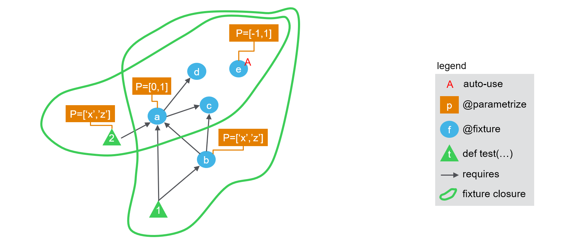

# Theory behind [`fixture_union`](pytest_goodies.md#fixture_union)

## 1. How `pytest` works today

As of `pytest` 5, there are three kind of concepts at play to generate the list of test nodes and their received parameters ("call spec" in pytest internals).

 - test functions are the functions defined with `def test_<name>(<args>)`.
 
 - they can be parametrized using `@pytest.mark.parametrize` (or our enhanced version [`@parametrize`](pytest_goodies.md#parametrize)). That means that some of the `<args>` will take several values, and for each combination a distinct test node will be created
 
 - they can require *fixtures*, that is, functions decorated with `@pytest.fixture` (or our enhanced version [`@fixture`](pytest_goodies.md#fixture)). That means that some of the `<args>` will take the value of the corresponding fixture(s).
 
 - fixtures can be parametrized too (with [`@fixture`](pytest_goodies.md#fixture) it is easier :) ), and can require other fixtures.
 
 - finally fixtures can enable an "auto-use" mode, so that they are called even when not explicitly required by anything.

Therefore, a test plan can be represented as an acyclic directed graph of fixtures, where nodes are fixtures and edges represent dependencies. On top of this layout, we can overlay the information of which fixture nodes are parametrized, which ones are required by which test function, and which test function is parametrized. The resulting figure is presented below:


The following code can be used to easily check the number of tests run. Note that we use `@fixture` and `@parametrize` from `pytest-cases` to ease code readability here but you would get a similar behaviour with `@pytest.fixture` and `@pytest.mark.parametrize` (the test ids would not show the parameter names by default though, which is helpful for our demonstration here).

```python
from pytest_cases import fixture, parametrize

@fixture(autouse=True)
@parametrize(ie=[-1, 1])
def e(ie):
    return "e%s" % ie

@fixture
def d():
    return "d"

@fixture
def c():
    return "c"

@fixture
@parametrize(ia=[0, 1])
def a(c, d, ia):
    return "a%s" % ia + c + d

@parametrize(i2=['x', 'z'])
def test_2(a, i2):
    assert (a + i2) in ("a0cdx", "a0cdz", "a1cdx", "a1cdz")

@fixture
@parametrize(ib=['x', 'z'])
def b(a, c, ib):
    return "b%s" % ib + c + a

def test_1(a, b):
    assert a in ("a0cd", "a1cd")
    assert a == b[-4:]
    assert b[:-4] in ("bxc", "bzc")
```

calling `pytest` yields:

```
============================= test session starts =============================
collecting ... collected 16 items

test_doc_fixture_graph.py::test_2[ie=-1-ia=0-i2=x] 
test_doc_fixture_graph.py::test_2[ie=-1-ia=0-i2=z] 
test_doc_fixture_graph.py::test_2[ie=-1-ia=1-i2=x] 
test_doc_fixture_graph.py::test_2[ie=-1-ia=1-i2=z] 
test_doc_fixture_graph.py::test_2[ie=1-ia=0-i2=x] 
test_doc_fixture_graph.py::test_2[ie=1-ia=0-i2=z] 
test_doc_fixture_graph.py::test_2[ie=1-ia=1-i2=x] 
test_doc_fixture_graph.py::test_2[ie=1-ia=1-i2=z] 
test_doc_fixture_graph.py::test_1[ie=-1-ia=0-ib=x] 
test_doc_fixture_graph.py::test_1[ie=-1-ia=0-ib=z] 
test_doc_fixture_graph.py::test_1[ie=-1-ia=1-ib=x] 
test_doc_fixture_graph.py::test_1[ie=-1-ia=1-ib=z] 
test_doc_fixture_graph.py::test_1[ie=1-ia=0-ib=x] 
test_doc_fixture_graph.py::test_1[ie=1-ia=0-ib=z] 
test_doc_fixture_graph.py::test_1[ie=1-ia=1-ib=x] 
test_doc_fixture_graph.py::test_1[ie=1-ia=1-ib=z] 

============================= 16 passed in 0.14s ==============================
```

So each test is called 8 times. How are these calls computed ?

 - first for each test, `pytest` computes the set of all fixtures that are directly or indirectly required to run it. This is known as the "fixture closure". So for `test_1` this closure is `{a, b, c, d, e}` while for test 2 it is `{a, c, d, e}`. We can show this on the following picture:



 - then a cartesian product is made across the parameters of all parametrization marks found on any item in the closure (including parameters of the test itself), So for `test_1` the cartesian product is `<ie> x <ia> x <ib>` while for `test_2` it is `<ie> x <ia> x <i2>`. This is why both tests result in having 8 variants being called (see details in the test ids above).


## 2. Extension to fixture unions.

A fixture union is by definition a fixture that is parametrized to alternately depend on other fixtures. We will represent this in the figures with a special dashed orange arrow, to remind that a special parameter is associated with the selection of which arrow is activated. 

Let's consider the following modification of the above example, where we introduce two "unions": one as an explicit fixture `u`, and the other implicitly created by using `fixture_ref`s in the parametrization of `b`.


We can create such a configuration with a slight modification to the above example:

```python
from pytest_cases import fixture, parametrize, fixture_ref, fixture_union

(... same as above ...)

@fixture
@parametrize(ib=['x', 'z'])
@parametrize(ub=(fixture_ref(a), fixture_ref(c)), idstyle="explicit")
def b(ub, ib):
    return "b%s" % ib + ub

u = fixture_union("u", (a, b), idstyle="explicit")

def test_1(u):
    pass
```

Note the `idstyle="explicit"` keyword arguments, that will help us get more details in the test ids.

Calling `pytest` yields:

```
============================= test session starts =============================
collecting ... collected 24 items

test_doc_fixture_graph_union.py::test_2[ie=-1-ia=0-i2=x] PASSED          [  4%]
test_doc_fixture_graph_union.py::test_2[ie=-1-ia=0-i2=z] PASSED          [  8%]
test_doc_fixture_graph_union.py::test_2[ie=-1-ia=1-i2=x] PASSED          [ 12%]
test_doc_fixture_graph_union.py::test_2[ie=-1-ia=1-i2=z] PASSED          [ 16%]
test_doc_fixture_graph_union.py::test_2[ie=1-ia=0-i2=x] PASSED           [ 20%]
test_doc_fixture_graph_union.py::test_2[ie=1-ia=0-i2=z] PASSED           [ 25%]
test_doc_fixture_graph_union.py::test_2[ie=1-ia=1-i2=x] PASSED           [ 29%]
test_doc_fixture_graph_union.py::test_2[ie=1-ia=1-i2=z] PASSED           [ 33%]
test_doc_fixture_graph_union.py::test_1[ie=-1-u\a-ia=0] PASSED           [ 37%]
test_doc_fixture_graph_union.py::test_1[ie=-1-u\a-ia=1] PASSED           [ 41%]
test_doc_fixture_graph_union.py::test_1[ie=-1-u\b-ib=x-ub\a-ia=0] PASSED [ 45%]
test_doc_fixture_graph_union.py::test_1[ie=-1-u\b-ib=x-ub\a-ia=1] PASSED [ 50%]
test_doc_fixture_graph_union.py::test_1[ie=-1-u\b-ib=x-ub\c]  PASSED     [ 54%]
test_doc_fixture_graph_union.py::test_1[ie=-1-u\b-ib=z-ub\a-ia=0] PASSED [ 58%]
test_doc_fixture_graph_union.py::test_1[ie=-1-u\b-ib=z-ub\a-ia=1] PASSED [ 62%]
test_doc_fixture_graph_union.py::test_1[ie=-1-u\b-ib=z-ub\c] PASSED      [ 66%]
test_doc_fixture_graph_union.py::test_1[ie=1-u\a-ia=0] PASSED            [ 70%]
test_doc_fixture_graph_union.py::test_1[ie=1-u\a-ia=1] PASSED            [ 75%]
test_doc_fixture_graph_union.py::test_1[ie=1-u\b-ib=x-ub\a-ia=0] PASSED  [ 79%]
test_doc_fixture_graph_union.py::test_1[ie=1-u\b-ib=x-ub\a-ia=1] PASSED  [ 83%]
test_doc_fixture_graph_union.py::test_1[ie=1-u\b-ib=x-ub\c] PASSED       [ 87%]
test_doc_fixture_graph_union.py::test_1[ie=1-u\b-ib=z-ub\a-ia=0] PASSED  [ 91%]
test_doc_fixture_graph_union.py::test_1[ie=1-u\b-ib=z-ub\a-ia=1] PASSED  [ 95%]
test_doc_fixture_graph_union.py::test_1[ie=1-u\b-ib=z-ub\c] PASSED       [100%]

======================== 24 passed, 1 warning in 0.30s ========================
```

Now 24 tests were created ! `test_2` still has 8 runs, which is normal as it does not depend on any union fixture. Let's try to understand what happened to parametrization of `test_1`. It is actually fairly simple: 

 - first a global fixture closure is created as usual, consisting in `{u, a, b, c, d, e}`
 
 - then for each union fixture in `test_1`'s closure, starting from the bottom of the graph, we generate several closures by activating each of the arrows in turn. We progress upwards through the graph of remaining dependencies for each alternative:

    - first `u` is used to split between subgraphs `u\a` and `u\b`
    - subgraph `u\a` does not contain any union. Its final closure is `{u, a, c, d, e}`
    - for subgraph `u\b` there is another union. So a new split is generated:
    
        - subgraph `u\b-ub\a` does not contain any union. Its final closure is `{u, b, a, c, d, e}`
        - subgraph `u\b-ub\c` does not contain any union. Its final closure is `{u, b, c, e}`


So the result consists in **3 alternate fixture closures** for `test_1`:


 - finally, as usual, for each closure a cartesian product is made across the parameters of all parametrization marks found on any item in the closure (including parameters of the test itself), So 
 
    - for `test_1` alternative `u\a`, the cartesian product is `<ie> x <ia>`  (4 tests) 
    - for `test_1` alternative `u\b-ub\a`, the cartesian product is `<ie> x <ia> x <ib>`  (8 tests) 
    - for `test_1` alternative `u\b-ub\c`, the cartesian product is `<ie> x <ib>`  (4 tests) 
    - for `test_2` it is `<ie> x <ia> x <i2>`. (8 tests).

The total is indeed 4 + 8 + 4 + 8 = 24 tests. Once again the test ids may be used to check that everything is correct, see above.
