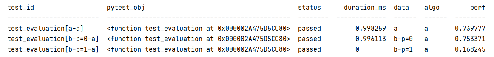

# Summary

Most Machine Learning research papers typically propose a new approach or 
algorithm and assess it with a results table comparing its performances against 
other candidates from the state-of-the-art, on a set of simulated and/or 
real-world reference datasets. 

Designing the code to create such a results table is tideous and repetitive, and
is an error-prone process: developers have to ensure that candidate algorithms 
are treated equally and evaluated following the exact same experimental 
protocol. Failure to do so can lead authors to draw considerably wrong
conclusions from their experiments, while being honestly convinced about the
quality of their results. This may be enforced by the fact that the author of 
the theorical proposal may be a different person than the implementor of the
code to create the results table.

In the recent years the topic of reproducibility in Machine Learning research
has shown growing interest, with studies such as [@Raff:2019] or 
[@Olorisade:2017]. We claim that encouraging researchers to use a common pattern
to design their experimental code will be a significant step towards 
reproducibility. In particular, clear separation of datasets from algorithms
on one side and of evaluation protocol from algorithms on the other side, seems
key to avoid conscious or unconscious knowledge leakage that may bias the 
results.

`pytest-cases` is a Python package leveraging the widely popular `pytest`
library [@pytest] to design tests and benchmarks where test data, tested code, 
and evaluation protocols are strictly separated. The API for `pytest-cases` is
as minimal as possible, so that each concept (test data, algorithms candidates,
evaluation protocols) is a readable python function ; this is in line with the
design philosophy of `pytest` itself. For example the results table in figure
\autoref{fig:example_results_table} can be generated with the following code:

```python
from random import random
from tabulate import tabulate
from pytest_cases import parametrize, parametrize_with_cases

def data_a():
    # a simple test case is a function.
    # You can read or generate the dataset here
    return "<data>"

@parametrize(p=range(2))
def data_b(p):
    # test cases can be easily parametrized
    # and can require fixtures (database connections...)
    return "<data%s>" % p

def algo_a():
    # you can use different prefixes for different *kind* of test cases
    # (algorithms, datasets, users, etc.)
    return 1

@parametrize_with_cases("algo", cases=".", prefix="algo_")
@parametrize_with_cases("data", cases=".", prefix="data_")
def test_evaluation(algo, data, results_bag):
    # you can use `results_bag` from `pytest_harvest` to store perf metrics 
    # (here you would actually *use* the algorithm on the data!)
    results_bag.perf = random()

def test_synthesis(module_results_df):
    # you can use `module_results_df` from `pytest_harvest` 
    # to collect the final results table.
    print(tabulate(module_results_df, headers="keys"))
```



`pytest-cases` introduces a few major modifications in the `pytest` engine in 
order to manage fixture unions, lazy parameter values, and fixture references 
in parameters ; all of these being required to manage test cases that can be
parametrized and require fixtures. In particular, the new concept of "fixture 
unions" deeply modifies the pytest parametrization process by creating
several independently parametrized fixture closures for each test function 
instead of a single one as in `pytest`. See \autoref{fig:union_closures} ; 
detailed explanations about this figure are available on the project page.


Finally, `pytest-cases` is fully compliant with the vast number of `pytest`
plugins available, such as `pytest-html` for html reporting, `pytest-profiling`
for detailed code profiling with user-friendly SVG output, or `pytest-harvest`
for easy collection of test artifacts (such as algorithm performance metrics),
as already shown in the example above.

# Acknowledgements

This work would not have been possible without the feedback from `pytest-cases`
users, on stackoverflow or on the github issues page. Asking questions, sharing
strange results and issues, and asking for new features *does* make a 
difference ! Thank you.

# References
